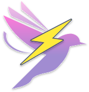
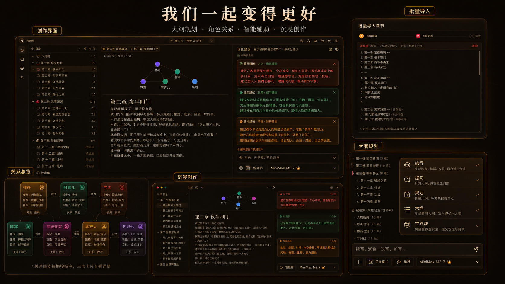

# Narraverse

**Bring writing back to purity and freedom.**

*Next-generation intelligent novel writing platform*

[中文说明](./README.zh-CN.md)

---

## What is Narraverse

Narraverse is a writing home built for novelists — a quiet corner where your story, your characters, and your world can grow together. Whether you are drafting your first chapter or managing a long-running series, Narraverse keeps structure, lore, and prose in one place so you can focus on the work that only you can write.

We believe good tools should stay out of the way. Every feature is designed to feel like a small instrument on your desk: gentle, unobtrusive, and there when you need it.

---

## Four pillars of your creative workflow

| Outline Planning | Character Relationships | Intelligent Assistance | Immersive Creation |
| --- | --- | --- | --- |
| Organize volumes, chapters, and story beats | See who appears in each scene and how they connect | Get thoughtful suggestions without losing your voice | Write in a calm, distraction-free space |

---

## Write with clarity

**Structured manuscript management**  
Organize your work by volume and chapter. Track drafts, jump between scenes, and keep your project tidy as the story grows.

**Immersive writing mode**  
Strip away everything except your manuscript and your thoughts. When you are in flow, the interface steps back.

**Day and night, your way**  
Switch between light and dark themes — and pick accent colors that match your mood. Comfortable at noon or at 2 a.m.

**Beautiful exports**  
Turn drafts into polished Markdown or plain text with one click, ready to share or archive.

---

## Know your cast

**Character relationship overview**  
Build a visual map of your story’s cast — identity, personality, goals, and the ties between them.

**Scene-level relationship preview**  
While you write a chapter, see which characters are present and how their relationships play out in that moment.

**Import and analyze**  
Paste an existing manuscript and let Narraverse recognize chapter breaks for you. Optionally run character analysis to populate your relationship map from the text you already have.

---

## Plan the story before and while you write

**Outline tree**  
Break your novel into volumes and chapters. Adjust structure as the plot evolves.

**Planning files**  
Capture story arcs, turning points, and foreshadowing payoffs — your long-form notes, always tied to the project.

**Worldbook**  
Keep settings, factions, rules, and lore in one consistent bible. When details matter, they are never more than a glance away.

**Timeline management**  
Track key events across your story so chronology stays coherent.

---

## Your AI partner — editor, not ghostwriter

Narraverse includes an all-in-one novel authoring Agent with five modes, each with a clear role in your workflow:

| Mode | What it does |
| --- | --- |
| **Agent** | Continue, polish, and edit your manuscript — with your approval on every change |
| **Ask** | Read-only advice on plot, dialogue, and craft — it never touches your files |
| **Plan** | Shape story arcs and beats into planning documents |
| **Outline** | Build and refine your volume/chapter structure |
| **Worldbook** | Organize and cross-link lore so continuity holds |

**You approve every edit.**  
Suggested changes appear as diffs. Accept or reject line by line — the story stays yours.

**Memory lives in your project.**  
Plans, outlines, worldbook entries, and chapters share one source of truth. Before continuing a scene, the Agent reads what you have already written.

**Suggestions with context.**  
Plot, scene, and line-level feedback draw on your manuscript and lore — so advice fits your story, not a generic template.

---

## Publish when you are ready

Manage draft and published states, preview your work, and share finished chapters when the time is right.

---

## Free for every creator

Narraverse is **completely free** at this stage. Drafting, AI assistance, character tools, outline and worldbook management — all open to every writer.

---

## Grow with us

Narraverse is built in the open with creators, not just for them. We listen to feedback, iterate quickly, and invite you to shape what comes next.

> *"Nothing is more painful than an untold story inside you."*

---

Questions or ideas? Join our community and tell us what would make your writing life better.

