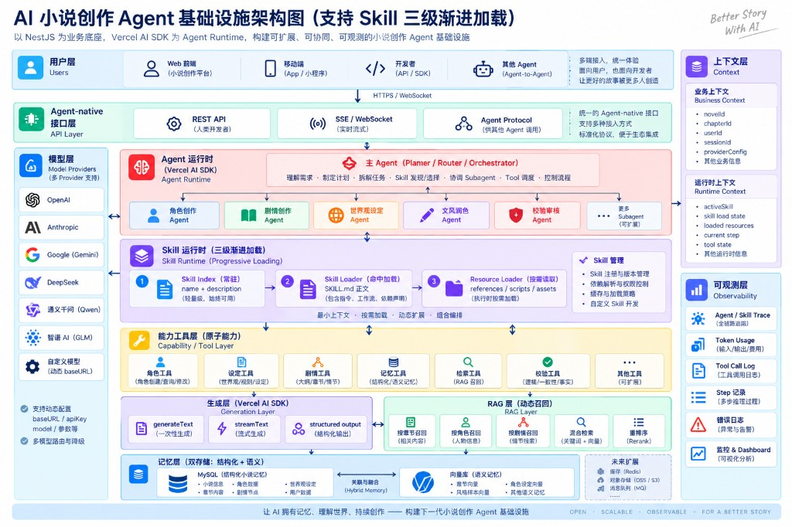

# @narraverse/backend

English | [中文](./README.zh-CN.md)

Narraverse business API and **AI novel-creation agent infrastructure**.

**NestJS** hosts domain APIs and auth. The **Vercel AI SDK** powers the agent runtime. The same capabilities are exposed to web clients, mobile apps, developer APIs, and other agents.

## Architecture



Design goals: **open, scalable, and observable** — agents with memory, world knowledge, and continuous creation.

| Layer | Responsibility |
| --- | --- |
| User | Web, apps/mini-programs, developers, other agents; HTTPS / WebSocket |
| Agent-native API | REST (human), SSE/WebSocket (streaming), Agent Protocol / A2A (agent-to-agent) |
| Model | OpenAI / Anthropic / Google / DeepSeek / Qwen / GLM / custom baseURL; routing and fallback |
| Agent runtime | Main agent (plan / route / orchestrate) + character / plot / world / polish / verify sub-agents |
| Skill runtime | 3-level progressive loading: resident index → load `SKILL.md` on hit → load resources on demand |
| Capability / tools | Atomic tools for characters, settings, plot, memory, retrieval, verification |
| Generation & RAG | `generateText` / `streamText` / structured output; chapter / character / plot retrieval and re-rank |
| Memory | MySQL structural memory + Qdrant semantic memory |
| Context / observability | Business and runtime context; tracing, tokens, tool calls, error logs |

## Stack

- **Runtime**: Node.js ≥ 24, pnpm, NestJS 12 (ESM)
- **Data**: Prisma 7 + MySQL 8; Qdrant vector store
- **Auth**: Better Auth (cookie / bearer)
- **Agent**: Vercel AI SDK (`ai`) + provider SDKs
- **Protocol**: A2A (`@a2a-js/sdk`) agent card / task streams
- **Docs**: OpenAPI + Scalar (`/api/v1/docs`)
- **Quality**: oxlint / oxfmt (repo root), Vitest

## Layout

```text
apps/backend
├── docs/architecture.jpg   # architecture diagram
├── docker-compose.yml      # MySQL + Qdrant (+ optional api)
├── prisma/                 # schema / migrations / seed
├── skills/                 # built-in skills (SKILL.md)
├── src/
│   ├── account/            # account & workspace
│   ├── admin/              # super-admin
│   ├── agent/              # models, runtime, tools, memory, tracing
│   ├── a2a/                # Agent2Agent gateway
│   ├── auth/               # Better Auth
│   ├── content/            # news / surveys / todos, etc.
│   ├── library/            # novels / volumes / chapters / characters
│   ├── planning/           # worldbook / outline / timeline
│   ├── skill/              # skill registry, parse, assembly
│   ├── common/             # errors, guards, interceptors
│   └── openapi/            # OpenAPI supplements
└── test/                   # Vitest
```

## Quick start

Run commands from the monorepo root (pnpm workspace).

### 1. Env

```bash
cp apps/backend/.env.example apps/backend/.env
```

Set `BETTER_AUTH_SECRET` and `AI_CONFIG_SECRET` (each ≥ 32 characters).

### 2. Infrastructure

```bash
cd apps/backend
docker compose up -d mysql qdrant
```

Defaults: MySQL `localhost:3307`, Qdrant `localhost:6333`.

### 3. Database

```bash
pnpm --filter @narraverse/backend db:generate
pnpm --filter @narraverse/backend db:migrate
pnpm --filter @narraverse/backend db:seed   # optional
```

### 4. Run

```bash
# from repo root
pnpm dev:backend
# or
pnpm --filter @narraverse/backend dev
```

Listens on `http://localhost:3001` with API prefix `api/v1`.

| Entry | URL |
| --- | --- |
| API docs | http://localhost:3001/api/v1/docs |
| OpenAPI JSON | http://localhost:3001/api/v1/openapi.json |
| Agent Card | http://localhost:3001/.well-known/agent-card.json |
| A2A | http://localhost:3001/api/v1/a2a |
| Health | see health module routes under `/api/v1` |

## Commands

```bash
pnpm --filter @narraverse/backend build
pnpm --filter @narraverse/backend typecheck
pnpm --filter @narraverse/backend test
pnpm --filter @narraverse/backend test:watch
pnpm --filter @narraverse/backend db:studio

# root quality gates (frontend + backend; apps/web excluded)
pnpm lint
pnpm format
```

## Modules

| Module | Description |
| --- | --- |
| Auth | Better Auth sign-up / sign-in / session |
| Account & workspace | Profile and aggregated workspace data |
| Library | Novels, volumes, chapters, characters, relationships |
| Planning | Worldbook, outline, planning files, timeline |
| Content & community | News, surveys, todos, message wall |
| Admin | Super-admin resource management |
| Agent infrastructure | Provider config, main/sub-agents, tool loops, RAG, semantic memory, run tracing |
| Skill | Marketplace, install, custom `SKILL.md`, novel binding, runtime assembly |
| A2A | Agent Card, messages, streaming tasks, lifecycle |

Business responses use a global envelope interceptor. AI SDK streams and A2A endpoints follow their own protocols and are not forced into that envelope.

## Skill runtime

Built-in skills live under `skills/<name>/SKILL.md`. `SkillRegistry` scans them on boot and syncs into the database.

Examples:

- `story-planning` — arcs and chapter beats
- `outline-editing` — outline edits
- `worldbook-editing` — world bible
- `brainstorm-facilitation` / `craft-discussion` — facilitation and craft talk
- `chinese-novel-style` / `polish-translate` / `editor-surgical` — style and polish

Progressive loading:

1. **Resident index** — name + description for discovery
2. **On hit** — full `SKILL.md` instructions and workflow
3. **On demand** — references/scripts only when execution needs them

New skills: directory name must match frontmatter `name`.

## Agents & models

- Runtime: `ToolLoopAgent`, `generateText` / UI message streams, structured `Output`
- Sub-agent role prompts: `src/agent/prompt.ts` (character / plot / world / polish / verify)
- Provider secrets encrypted with server-side `AI_CONFIG_SECRET`; dynamic baseURL and multi-model config supported
- Structural memory via Prisma/MySQL; semantic memory via Qdrant (`QDRANT_*`)

## Environment (summary)

Full template: [`.env.example`](./.env.example). Validation: `src/config/env-schema.ts`.

| Variable | Purpose |
| --- | --- |
| `PORT` / `API_PREFIX` | Port and global prefix |
| `DATABASE_*` / `DATABASE_URL` | MySQL |
| `BETTER_AUTH_SECRET` / `BETTER_AUTH_URL` | Auth |
| `APP_URL` / `CORS_ORIGINS` | Frontend origin and CORS |
| `AI_CONFIG_SECRET` | Encryption key for provider secrets |
| `AGENT_MAX_STEPS` / `AGENT_TIMEOUT_MS` | Agent step limit and timeout |
| `QDRANT_URL` / `QDRANT_COLLECTION` | Vector memory |

## Principles

1. **Open** — REST + streaming + A2A for humans and agents
2. **Scalable** — pluggable skills, tools, providers, and sub-agents
3. **Observable** — request ids, structured logs, agent traces, token metering

---

Local full-stack: from repo root run `pnpm dev:all` (`apps/frontend` + this service). Legacy `apps/web` is outside the primary development path.
